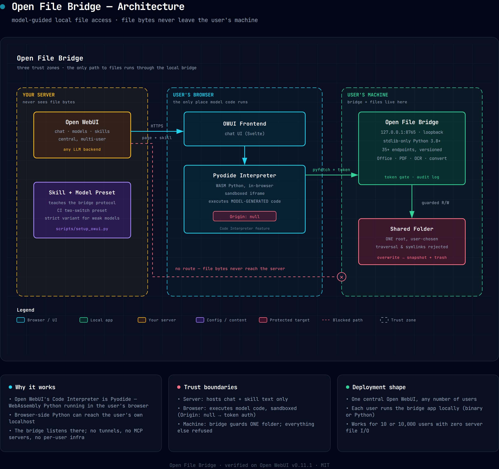
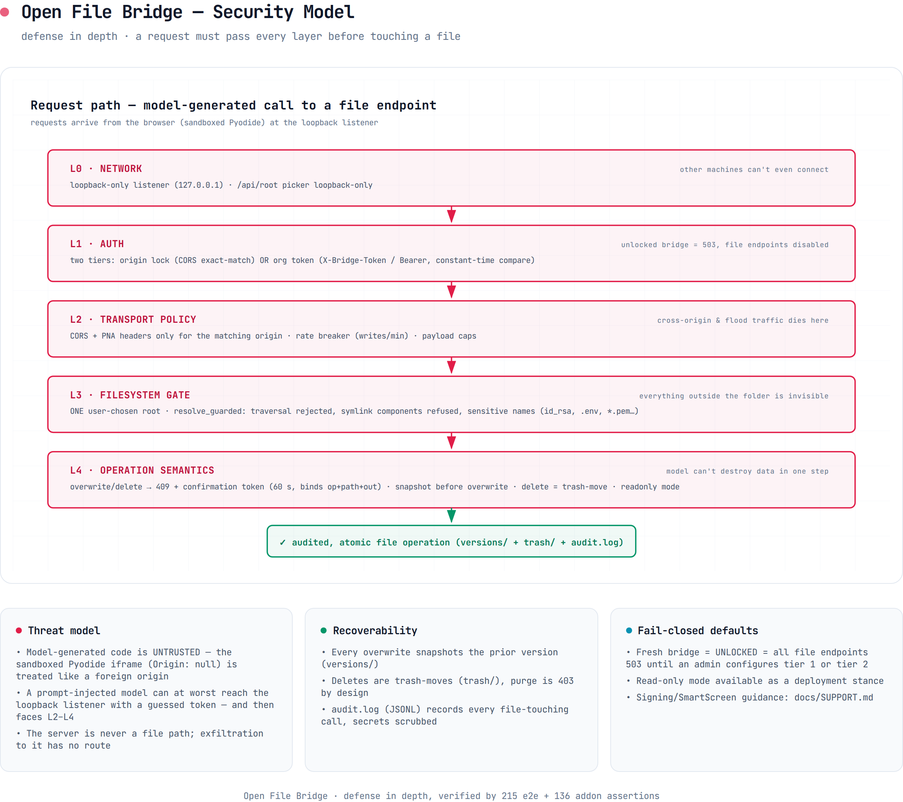

# Open File Bridge

**Let AI chat assistants read & write files on the user's own computer —
without any file ever touching your server.**

Built and verified against [Open WebUI](https://github.com/open-webui/open-webui),
but the bridge itself is a generic, localhost file API: any agent system whose
generated code executes **in the user's browser** (or on the user's machine)
can use it.

```
User: "read notes.txt in my folder"
  └─ Open WebUI model (your server) ── generates Python code
       └─ Pyodide runs it IN THE USER'S BROWSER
            └─ pyfetch → http://127.0.0.1:8765 (Open File Bridge, user's machine)
                 └─ reads/writes ONE folder the user chose
```



## Why you'd want this

- **Zero server-side file handling** — works for 10 or 10,000 users with no
  per-user infrastructure, no MCP servers, no tunnels, no cloud drives.
- **Privacy by architecture** — there is no route for file bytes to reach
  the server; the server only ever hosts chat and the skill text.
- **Real office work, not toys** — 35+ versioned endpoints: Word/Excel/
  PowerPoint/PDF creation & editing, OCR of scanned documents, LibreOffice
  format conversion, mail merge, zip/unzip, versioned writes with a trash
  bin and a full audit log.
- **Model-agnostic** — ships a standard skill for strong models and a
  strict variant (fixed recipes + verify-after-write) validated on weak
  models; see [Verified results](#verified-results).

## How it works

Open WebUI's Code Interpreter (Pyodide engine) is WebAssembly Python that
executes **in the user's browser**. Python running there can reach the
user's own localhost — which is exactly where Open File Bridge listens.
A public **Skill** (markdown instructions) teaches the model the fetch
pattern; a **model preset** turns the Code Interpreter on by default so
users just pick a model and ask.

| Piece | Where it lives | This repo |
|---|---|---|
| Skill (instructions, 2 variants) | OWUI Workspace, public | `skill/open-file-bridge/` |
| Model preset (CI on + skill) | OWUI Workspace, public | `scripts/setup_owui.py` |
| Open File Bridge app | Each user's machine | `src/file_bridge.py` + `build/` |

Other agent systems: if your runtime executes model-generated code
browser-side (WebAssembly sandbox, user scripts) it can talk to the same
HTTP API; if it runs on the user's machine, even simpler — the bridge is
just a localhost JSON API with token auth.

## Security model

Model-generated code is treated as **untrusted**. A request must pass
every layer below before touching a file:



- **L0 Network** — loopback-only listener; other machines can't connect.
- **L1 Auth** — two tiers: origin lock (CORS exact-match) or org token
  (`X-Bridge-Token`, constant-time compare). A fresh bridge **fails
  closed**: every file endpoint returns 503 until an admin configures one.
- **L2 Transport policy** — CORS/PNA headers only for the matching origin,
  write-rate breaker, payload caps.
- **L3 Filesystem gate** — exactly ONE user-chosen folder; `../` traversal
  rejected, symlink components refused, credential-looking filenames
  (`id_rsa`, `.env`, `*.pem`…) blocked outright.
- **L4 Operation semantics** — overwrites & deletes require a 409
  confirmation token (60 s, bound to op+path+out); every overwrite
  snapshots the prior version; deletes are trash-moves (purge is 403 by
  design); JSONL audit log with secret scrubbing; optional read-only mode.

Current Open WebUI `:main` builds run Pyodide in a sandboxed iframe
(`Origin: null`) — use tier-2 token mode there. Details, upgrade
checklist and the full analysis: [docs/OWUI-COMPAT.md](docs/OWUI-COMPAT.md).

## Setup

### Admin (once) — manual setup

What the setup script automates, spelled out so you can do it (and audit it)
by hand in the Open WebUI UI:

1. **Publish the skill** — *Workspace → Skills → Create*: set id
   `open-file-bridge`, paste the contents of
   [`skill/open-file-bridge/SKILL.md`](skill/open-file-bridge/SKILL.md),
   save — then set the skill's visibility to **public** (users need read
   access or their models can't load it).
2. **Create the assistant model (custom model)** — *Workspace → Models →
   Create*: base it on a strong chat model, then under
   **Capabilities** enable **Code Interpreter** *and* mark it as a
   **default** feature — **both switches matter**: with only the capability
   checked, new chats start with the interpreter toggle OFF and the model
   can never run code. Under **Skills**, attach `open-file-bridge`.
   (Weak models that wander into the sandbox? Publish the stricter
   `SKILL-STRICT.md` as a second skill + second model.)
3. **Distribute the app** — every `v*` tag makes CI build signed-off
   packages for all three OSes (grab them from the release's Actions
   artifacts): Windows zip/installer, macOS `.app` zip, Linux binary — or
   users run from source with `python3 src/file_bridge.py <folder>`
   (zero pip dependencies). Decide the **auth tier** up front (current
   Open WebUI builds need token mode — see
   [admin-guide](docs/admin-guide.md)) and hand users their org token if
   you use one.
4. Sanity-check the result as a user (checklist below).

Scripted shortcut for steps 1–2 (idempotent, same REST calls, no code
changes to Open WebUI):

```bash
python3 scripts/setup_owui.py --url http://your-owui:8080 \
    --email admin@… --password '…' --base-model glm-5.3-flash
# weaker models (they wander into the sandbox instead of the bridge)?
# add a strict-variant preset with fixed recipes + verify-after-write:
python3 scripts/setup_owui.py … --variant-strict-model glm-4.5-air
# or make strict the ONLY skill (org standardizes on small models):
python3 scripts/setup_owui.py … --variant strict
```

### User checklist

Preconditions — confirm these before anything else:

- [ ] **Allowed by your admin**: a local-files assistant model appears in
      your model list (usually "Local Files Assistant") — that means the
      skill is published and Code Interpreter pre-enabled for you
- [ ] **The app**: download Open File Bridge for your OS from the
      releases your admin points you to (or run from source — no install)
- [ ] **Browser**: Chrome, Edge or Firefox — *not* Safari (it blocks the
      localhost fetches this needs)

Then:

1. **Install & launch the app**, pick the folder you want to share — the
   settings page opens in your browser.
2. **Configure access** the way your admin instructed (paste the org
   token, or allow your Open WebUI origin). Until then the bridge stays
   locked and every file request fails — that's by design.
3. **New chat → select the assistant model** → ask something like
   *"list the files in my folder"*. If the browser asks about
   **local network access**, click **Allow**.
4. **Using your own model instead of the preset?** Two extra switches:
   enable the **Code Interpreter** toggle in the chat's feature bar, and
   enable/[$-mention](docs/user-guide.md) the `open-file-bridge` skill.
   Everything else is identical.

Full walkthrough incl. permission prompts and troubleshooting:
[docs/user-guide.md](docs/user-guide.md).

## Verified results

Real-browser chat runs, asserting the file **actually lands on disk**
(not claimed in prose) — harness and evidence in
[docs/ROADMAP.md](docs/ROADMAP.md) §multi-model smoke:

| Model | Skill | Result |
|---|---|---|
| glm-5.3 | standard | ✅ full flow: /list → /read → /write, file on disk |
| glm-5.3 | standard, unified description | ✅ no regression |
| glm-5.2 | standard | ✅ honest failure when bridge unreachable (stops, no fabrication) |
| glm-4.5-air | strict, old description | ❌ fabricated success (wrote to Pyodide virtual FS, zero bridge calls) |
| glm-4.5-air | strict, failure-mode description | ✅ full bridge flow, file on disk |

Key lesson (validated both ways): models are only guaranteed to see a
skill's **name + description** — the description must state the failure
mode ("files written with `open()/os` are LOST and INVISIBLE to the
user"), not list features. Both shipped skill variants carry this wording.

## Compatibility

| | Status |
|---|---|
| Open WebUI | v0.11+ (Skills feature); verified on 0.11.1 and 0.10.2 — per-upgrade checklist in [OWUI-COMPAT](docs/OWUI-COMPAT.md) |
| Browsers | ✅ Chrome, Edge, Firefox · ❌ **Safari** (blocks localhost fetches) |
| OS | Windows 10/11 · macOS 11+ · Linux |
| Python (running from source) | 3.8+, **zero pip dependencies** for the core; optional add-ons (pymupdf, tesseract) enable OCR/PDF endpoints (clear 501 without) |

## Repository layout

```
├── src/file_bridge.py            # the app — single file, stdlib-only (3.8+)
│                                 #   (+ src/wheels/, src/tessdata/ assets)
├── skill/open-file-bridge/      # OWUI skill: SKILL.md, SKILL-STRICT.md, CHANGELOG
├── scripts/setup_owui.py         # idempotent admin setup via OWUI REST API
├── build/                        # Linux/Windows/macOS packaging (PyInstaller, Inno)
├── .github/workflows/build.yml   # CI: all 3 OSes on tag push
├── tests/e2e_test.sh             # 215 endpoint + security assertions
├── tests/addon_test.sh           # 136 add-on suite (Office/PDF/OCR/convert)
└── docs/                         # guides, compat window, support runbook, diagrams
```

## Documentation

| Doc | For |
|---|---|
| [user-guide.md](docs/user-guide.md) | end users — install, first chat, prompts |
| [admin-guide.md](docs/admin-guide.md) | admins — setup, hardening, tiers, variants |
| [OWUI-COMPAT.md](docs/OWUI-COMPAT.md) | compatibility window + per-upgrade checklist |
| [SUPPORT.md](docs/SUPPORT.md) | SmartScreen, port 8765, Safari runbook |
| [BUILDING.md](docs/BUILDING.md) | building the per-OS packages |
| [RCLONE.md](docs/RCLONE.md) | mounting cloud drives into the shared folder |
| [ROADMAP.md](docs/ROADMAP.md) | design decisions, verified results, history |
| [DEVNOTES.md](docs/DEVNOTES.md) | every gotcha we hit (agent-friendly) |

## What this is not

- Not a file-sync or RAG system — it's live read/write of the current
  folder contents into the chat.
- Not a way to bypass the user: the folder is chosen by the user, the
  browser asks consent for local-network access, and the bridge only
  ever serves that one folder.
- Not Safari-compatible (fundamental browser limitation).

## License

Apache-2.0 — open for any use, with patent grant. See [LICENSE](LICENSE),
[NOTICE](NOTICE) (attributions to OpenWorker & Open WebUI openapi-servers),
and [CLA.md](CLA.md) (contributions).
